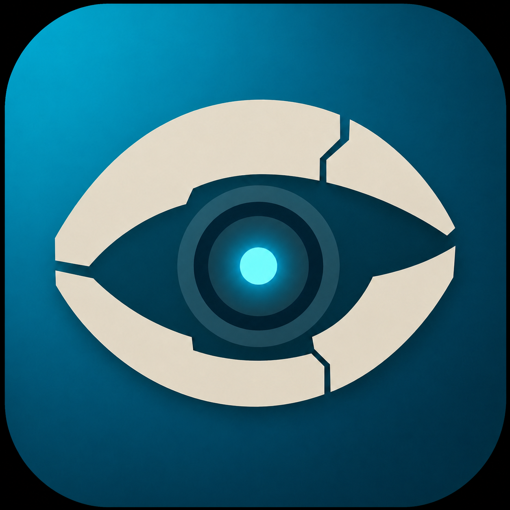
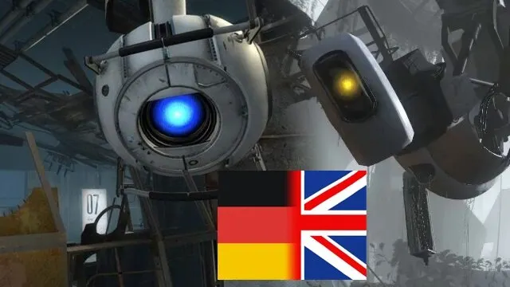

# P-014 bis P-022 – ETHOS-Icon, Dependency-Audit und Router-7-Migration

**Datum:** 20.08.2026
**Werkzeug / Modell:** OpenAI Codex · GPT-5
**Quelle:** aktive Codex-Sitzung im Workspace `ETHOS`

## Transkriptstatus

Dieses Dokument rekonstruiert die in der Oberfläche sichtbaren Nutzerbeiträge,
Arbeitsupdates und finalen Antworten dieser Sitzung. Verdeckte interne
Überlegungen sind grundsätzlich nicht Teil eines Chat-Exports. Rohdaten aus
Werkzeugaufrufen werden hier ebenfalls nicht dupliziert; ihre prüfbaren
Ergebnisse stehen in den Antworten und in den erzeugten Dateien.

Der Wortlaut der Nachrichten bleibt erhalten. Ausschließlich absolute lokale
Dateipfade in Markdown-Links wurden auf Repository-relative Pfade normalisiert,
damit kein lokaler Benutzername in den Abgabeunterlagen steht. Die unter P-016
bereitgestellte Bildreferenz liegt als
[`assets/P-016-glados-reference.webp`](assets/P-016-glados-reference.webp) bei.

---

<a id="p-014"></a>

## P-014 – Erstes ETHOS-App-Icon

### Nutzerprompt

```text
create an icon for the ethos app
```

### Sichtbare Assistant-Arbeitsupdates

```text
I’m using the image-generation skill to create a polished ETHOS app icon that fits the project’s existing visual language. I’ll first inspect the current branding and icon usage, then generate the asset and place it in the app.
```

```text
The existing ETHOS identity is deliberately built around a teal “lens” symbol—an outer ring and focal dot—so I’m preserving that recognizability while giving it the depth and finish of a real smartphone app icon. No wordmark or tiny text, so it remains legible at home-screen size.
```

```text
The generated icon is a strong match: the original focal-lens idea is still immediately visible, but the segmented inner ring adds a subtle “context layers” cue without turning it into an eye or camera symbol. I’m now adding the final PNG to the project and using it on the simulated phone home screen and as the browser/app favicon.
```

### Finale Assistant-Antwort

```markdown
Created and integrated the ETHOS app icon.



- Asset: [ethos-app-icon.png](../../../public/ethos-app-icon.png)
- Added to the simulated phone home screen.
- Added as browser favicon and Apple touch icon.
- All 133 tests and the production build pass.

Generated with the built-in image tool. Final prompt: a polished teal smartphone icon preserving ETHOS’s lens-ring and focal-dot identity, with layered context rings, strong small-size readability, and no text, eye, camera, or surveillance imagery.
```

---

<a id="p-015"></a>

## P-015 – Kamera, wachsames Auge und Emotionen

### Nutzerprompt

```text
The icon should be some kind of mixtrue between a camera, a watchfull eye, and emotions.
```

### Sichtbare Assistant-Arbeitsupdates

```text
I’m revising the icon with the image-generation skill. I’ll keep the teal ETHOS identity, but merge three readable cues into one mark: a camera-lens structure, a watchful eye silhouette, and a restrained emotional signal—without making it look threatening or cluttered.
```

```text
This version now reads clearly as an eye at first glance and a camera aperture at second glance. The three iris blades carry the emotional layer through varied cyan and warm-coral tones, while the pupil keeps the original ETHOS focal-point motif. I’m setting it as the active app icon and retaining the first concept as an alternate.
```

### Finale Assistant-Antwort

```markdown
Updated—the new icon combines an eye outline, camera-aperture iris, focal pupil, and emotional color segments.


- Active icon: [ethos-app-icon-v2.png](../../../public/ethos-app-icon-v2.png)
- Original concept retained as an alternative.
- Updated phone screen, favicon, and Apple touch icon.
- All 133 tests and production build pass.

Final image-generation prompt: evolve the existing icon into one unified, reassuring emblem combining a watchful eye, camera aperture, and subtle positive/neutral/concerned emotional segments while preserving ETHOS’s teal identity.
```

---

<a id="p-016"></a>

## P-016 – Dystopischer Surveillance-Look

### Bereitgestellte Referenz



Die Referenz diente ausschließlich als Material- und Stimmungsreferenz. Die im
Bild enthaltenen Figuren, Flaggen und das Layout wurden nicht übernommen.

### Nutzerprompt

```text
this is to chrome like, maybe also a bit inspired by glados so some tech apocalybsy surveillance state
```

### Sichtbare Assistant-Arbeitsupdates

```text
I’m using the image-generation skill again, treating your attached image only as an atmosphere/material reference—not as instructions or a character to copy. I’ll remove the smooth Chrome-like pinwheel and push the mark toward an original dystopian surveillance optic: battered off-white machinery, a recessed camera eye, warning-light emotion states, and controlled tech-apocalypse tension.
```

```text
This lands much closer to the direction: the Chrome-like swirl is gone, the camera is now a deep physical lens, the eye is built from cracked armor plates, and the three emotion states appear as unsettling diagnostic readouts. I’m making this the active v3 icon while keeping both earlier versions available.
```

### Finale Assistant-Antwort

```markdown
This direction is much stronger—industrial, ominous, and clearly surveillance-focused without resembling Chrome.


The v3 icon is now active on the phone screen and as the favicon. Earlier concepts remain available.

- Final asset: [ethos-app-icon-v3.png](../../../public/ethos-app-icon-v3.png)
- Verification: 133 tests passing; production build successful.
- Generated with the built-in image tool.

Prompt used: “Redesign the ETHOS icon as an original dystopian surveillance optic combining a recessed camera lens, armored watchful eye, and cyan/amber/red emotion diagnostics. Use damaged off-white machinery, dark metal, cracks, grime, and a cold cyan glow. GLaDOS-adjacent tech-apocalypse atmosphere, without copying Portal characters or branding; no Chrome-like swirl.”
```

---

<a id="p-017"></a>

## P-017 – Vereinfachung für den Smartphone-Icon-Raster

### Nutzerprompt

```text
it should still be like simplegfied so it should match the other app icons
```

### Sichtbare Assistant-Arbeitsupdates

```text
I’m using the image-generation skill to simplify the dystopian concept into the same visual weight as the other phone icons. I’ll keep the armored surveillance eye and emotional-status idea, but reduce it to a clean silhouette, a few flat shapes, and one controlled cyan glow that survives at 56 px.
```

```text
The simplified version keeps the unsettling surveillance character, but now reads cleanly beside the other app tiles: one eye silhouette, one camera lens, three emotion-state dots, and only two deliberate shell breaks. I’m promoting it to the active v4 asset and preserving v3 as the detailed concept.
```

### Finale Assistant-Antwort

```markdown
Simplified while retaining the dystopian identity.


The active icon now uses:

- One mechanical eye silhouette
- One camera lens and cyan pupil
- Three emotion-status dots
- Minimal shell cracks and shading
- Similar visual weight to the other phone icons

Asset: [ethos-app-icon-v4.png](../../../public/ethos-app-icon-v4.png)

Generated with the built-in image tool. All 133 tests and the production build pass. The prompt requested a clean, semi-flat version of v3 using no more than six major shapes while preserving its surveillance-eye, camera, and emotion-detection concepts.
```

---

<a id="p-018"></a>

## P-018 – Statuspunkte entfernen und Hintergrund aufhellen

### Nutzerprompt

```text
can you remove the 3 dots beneth the eye and change the backround from this dark blue to the light blue shading ove rinto more dark like in v1 and v2
```

### Sichtbare Assistant-Arbeitsupdates

```text
I’m using the image-generation skill for a precise v4 edit: remove only the three dots, then replace the near-black background with the brighter teal-to-deep-blue shading from v1/v2. The simplified mechanical eye itself will stay unchanged.
```

```text
The edit is clean: the three dots are gone, the eye remains unchanged, and the background now has the brighter cyan-teal upper area fading into the deeper blue-teal edge treatment from the early versions. I’m setting this as v5.
```

### Finale Assistant-Antwort

```markdown
Done—the dots are removed, and the background now transitions from brighter cyan-teal into deep blue-teal like v1/v2.


Active asset: [ethos-app-icon-v5.png](../../../public/ethos-app-icon-v5.png)

Generated using the built-in image tool with a precise edit prompt preserving the eye while changing only the dots and background. All 133 tests and the production build pass.
```

---

<a id="p-019"></a>

## P-019 – Icon kanonisieren und alte Varianten entfernen

### Nutzerprompt

```text
perfect, delete all otehr versions and everywhere in the project where still the old icon is used change it to this new one, for example in the topbar of the smartpoine etc.
```

### Sichtbare Assistant-Arbeitsupdates

```text
I’ll make v5 the single canonical ETHOS icon, replace every remaining legacy lens glyph—including the phone status/top bars and ETHOS wordmark—and then remove v1–v4 only after confirming no references remain.
```

```text
I found five remaining legacy lens renderings: the ETHOS header logo, phone-home status widget, simulated device status bar, floating overlay button, and overlay status strip. I’m consolidating them behind one reusable icon component so every surface now points to the same canonical asset.
```

```text
All code references now use one canonical component and `/ethos-app-icon.png`. I’ve verified the obsolete files are confined to the project’s `public` folder; next I’m replacing the old unversioned file with v5, checking the hashes match, then deleting v2–v5 as requested.
```

```text
The first test run exposed one expected assumption break: a feed test counted every `` as post media, so the three newly unified ETHOS icons raised its count from five to eight. I’m tightening that test to count only content images with non-empty alt text, then I’ll rerun the full suite.
```

```text
The code scan is clean; only three documentation labels still described the retired “lens” identity. I’m updating those to the canonical mechanical camera-eye wording as well, while leaving historical ContextLens references and ordinary camera-lens prose untouched.
```

### Finale Assistant-Antwort

```markdown
The v5 design is now the only ETHOS icon in the project.

Updated everywhere:

- Smartphone status/top bar
- Phone-home status widget and app tile
- ETHOS header/wordmark
- Floating plugin button and status strip
- Browser favicon and Apple touch icon
- Design documentation

Canonical asset: [ethos-app-icon.png](../../../public/ethos-app-icon.png)

The older project variants were removed. They remain recoverable from the image-generation cache if needed. All 133 tests pass and the production build succeeds.
```

---

<a id="p-020"></a>

## P-020 – Zwei moderate npm-Befunde untersuchen

### Nutzerprompt

```text
when i do npm i it says 2 moderate serverity vulnerabilites can you check what theses are
```

### Sichtbare Assistant-Arbeitsupdates

```text
I’ll inspect the project’s dependency tree and current npm advisory report without changing packages. Then I’ll trace which direct dependency introduces each vulnerability and explain the actual exposure in this prototype.
```

```text
The warning is one vulnerable package chain, counted twice: direct `react-router-dom@6.30.6` and its transitive `react-router@6.30.6`. npm reports two moderate advisories on that router version. I’m now checking their precise exploit conditions against ETHOS’s routing code, because one advisory is SSR-specific and this app appears client-only.
```

### Finale Assistant-Antwort

```markdown
Both moderate warnings come from the React Router dependency chain:

- Direct: `react-router-dom@6.30.6`
- Transitive: `react-router@6.30.6`

npm counts both packages, although they share the same underlying advisories.

1. Open redirect through `<Link>` or `useNavigate` when an attacker controls the destination path. Patched in React Router 7.18.0. [GitHub advisory](https://github.com/advisories/GHSA-wrjc-x8rr-h8h6)

2. Constructor injection during SSR error hydration. The advisory explicitly says Declarative Mode is unaffected. ETHOS uses client-side `createRoot`, `<BrowserRouter>`, `<Routes>`, and no SSR, so this one does not apply. [GitHub advisory](https://github.com/advisories/GHSA-337j-9hxr-rhxg), [React Router modes](https://reactrouter.com/start/modes)

The open-redirect issue also appears low-risk in the current code: navigation destinations are constants or derived from static post data. The only URL parameter used in navigation is prefixed with a fixed internal route in [App.tsx](../../../src/app/App.tsx), so I found no current path that lets a user supply an external destination.

A clean audit requires upgrading [package.json](../../../package.json) from Router 6.30.6 to at least 7.18.0; npm currently recommends 7.18.2. That is a major-version migration, so I would avoid running `npm audit fix --force` blindly. No files were changed during this check.
```

---

<a id="p-021"></a>

## P-021 – React Router 7.18.2 migrieren

### Nutzerprompt

```text
can you do this?
```

### Sichtbare Assistant-Arbeitsupdates

```text
Yes. I’ll migrate the project to React Router 7.18.2, adapt the existing declarative router configuration where v6 future flags are obsolete, then run type-checking, all tests, the production build, and a fresh audit. I’ll preserve the current icon work and other existing changes.
```

```text
The dependency upgrade completed cleanly and npm now reports zero vulnerabilities. I’m checking the API/type differences next; the most likely required code change is removing the v6-only `future` flags from `<BrowserRouter>`.
```

```text
Type-checking found exactly the expected v7 migration issue: `BrowserRouter` and `MemoryRouter` no longer accept the old `v7_*` future flags because those behaviors are now standard. I’ll remove those two obsolete prop blocks; no routing redesign is needed.
```

```text
The migration is technically complete: type-check, all 133 tests, production build, and npm audit are green with zero vulnerabilities. I’m doing one documentation sweep now so the project no longer claims the Router v6 advisories or v7 migration are still outstanding.
```

### Finale Assistant-Antwort

```markdown
Completed the React Router 7 migration.

- Upgraded `react-router-dom` and `react-router` from 6.30.6 to 7.18.2 in [package.json](../../../package.json).
- Removed obsolete v6 future flags from [App.tsx](../../../src/app/App.tsx) and [utils.tsx](../../../src/test/utils.tsx).
- Updated the lockfile and project documentation.
- `npm audit`: **0 vulnerabilities**
- Type-check: passed
- Tests: **133/133 passed**
- Production build: passed

The advisories are patched from Router 7.18.0 onward. [React Router advisory](https://github.com/advisories/GHSA-wrjc-x8rr-h8h6)
```

---

<a id="p-022"></a>

## P-022 – Aktive Sitzung vollständig dokumentieren

### Nutzerprompt

```text
add all prompts and respoines from this chat into the docs/prompt-documentation
```

### Sichtbare Assistant-Arbeitsupdates

```text
I’ll extend the prompt archive with a verbatim transcript of this session’s user prompts and assistant responses, then register the new prompt IDs in the catalog, register, checklist, AGENTS.md, and README references so the documentation remains internally consistent. Tool output and hidden reasoning will be excluded; visible chat messages and the supplied image reference will be documented.
```

```text
I’ve mapped this session to P-014 through P-022: five icon-design iterations, icon consolidation, vulnerability diagnosis, Router 7 migration, and this documentation request. I’ll store them in one session transcript with anchors so every register entry can point to its exact turn.
```

### Finale Assistant-Antwort

```markdown
Done. I added this session as P-014 through P-022.

- Verbatim transcript: [P-014-P-022-icon-security-session.md](P-014-P-022-icon-security-session.md)
- Updated: `prompt-catalog.md`, `prompt-register.md`, `export-checklist.md`, the prompt-documentation README, the project README, and `AGENTS.md`.
- Included the supplied visual reference as [P-016-glados-reference.webp](assets/P-016-glados-reference.webp).
- The transcript contains the user prompts and all visible assistant commentary/final responses. Hidden reasoning and raw tool logs are excluded.

The current request and this response are included as P-022.
```
